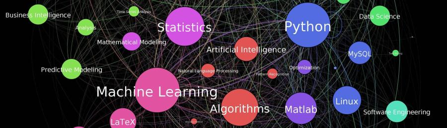

  

# Luciano Mancuso
Cientista de Dados - Panorama Doze

### Pós-graduado em Business Intelligence, possui larga experiência na área de TI, com mais de 20 anos no mercado. Atualmente é Cientista de Dados Sênior no Ministério da Saúde e Consultor da empresa Panorama Doze onde presta serviços de BI e Ciência de Dados desde 2013.

###Professor durante 8 anos na área financeira, estatística, banco de dados, análise de sistemas, desenvolvimento de sistemas, plano de negócios e também Coordenador Adjunto do curso de Administração na faculdade IESB de Brasília. Formado em Administração de Empresas pela UnB também cursou MBA em Marketing Digital.

**Links:**
* * [LinkedIn](https://www.linkedin.com/in/luciano-mancuso-ti)
* * [Medium](https://medium.com/@luciano.mancuso)

## Artigos:

* **A Lei de Benford:** https://bit.ly/3bMwEAf - Artigo no Medium - https://luciano-mancuso.medium.com/lei-de-benford-d5625aa70eb9
